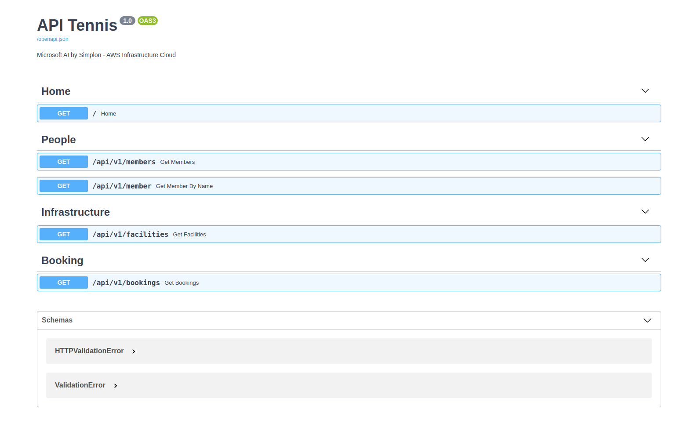
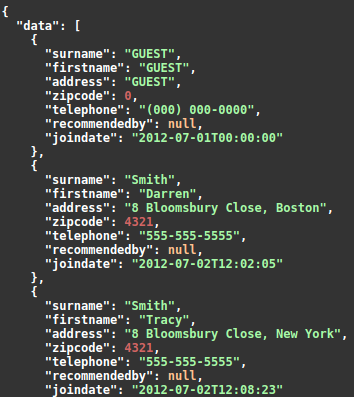
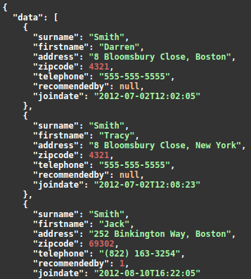
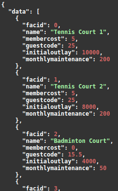

## Infrastructure

- **Database:** one `Postgresql` database is running on a RDS instance on AWS.  

- **Drive:** we have one S3 bucket to store the sql file.  

- **Application:** we created a reverse proxy with `Nginx` and an API with `FastApi`, they are both running on a virtual machine one an EC2 instance on AWS.

## Database initialisation storage

In order to store our sql initialization file, we created an Amazon S3 bucket. Then we just had to drag&drop the file on the S3 interface.

## Database creation

To create the database, we've decided to run a Postgres database on Amazon RDS. 
The first step was to connect to an EC2  instance via SSH protocol in order to have an Ubuntu terminal to run docker. 

Once we were connected to the VM, we ran a Postgres image in docker to have a way to use `psql`. Then we copy our SQL init file inside our VM, to copy it inside our docker container.

Once we got our file, we were able to connect with `psql` to our database server instance and initilialize it.

## API Access

You can access the API by following this [link](http://ec2-3-22-236-105.us-east-2.compute.amazonaws.com).

You will land on the documentation page.  

## Endpoints

- **Get all members** - [link](http://ec2-3-22-236-105.us-east-2.compute.amazonaws.com/api/v1/members)  

- **Get member by name** - e.g. "Smith" [link](http://ec2-3-22-236-105.us-east-2.compute.amazonaws.com/api/v1/member?name=Smith)   

- **Get all facilities** - [link](http://ec2-3-22-236-105.us-east-2.compute.amazonaws.com/api/v1/facilities)   

- **Get all bookings** - [link](http://ec2-3-22-236-105.us-east-2.compute.amazonaws.com/api/v1/bookings)

---

Feel free to star this repository or fork it if you find it usefull.  
Cheers!   